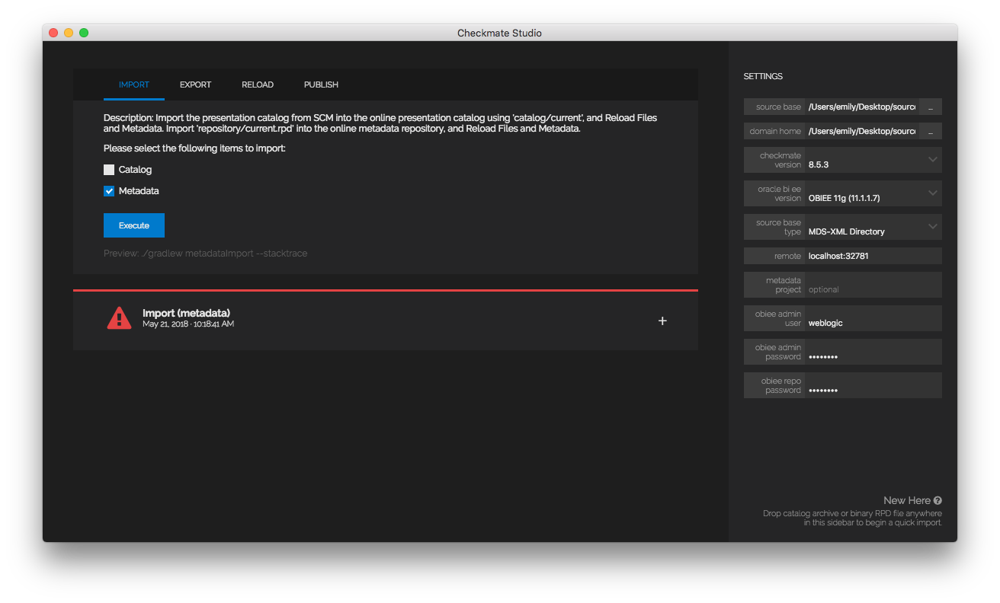

# Checkmate Examples
This repository includes examples for working with Checkmate from Red Pill Analytics. Checkmate enables Continuous Delivery for products or platforms that don't naturally support it. Checkmate is also used on real multi-user development with git for source control management (SCM).

### Checkmate Quickstart
The repository is designed to have a directory for each Checkmate plugin located in the project root (called the *plugin directory*), each containing one or more example projects located in separate directories (called the *project directory*.) The project directory contains a **README.md** file that contains the Quickstart description and exercises for working with Checkmate.

Currently, we only have a single Quickstart configured: [Checkmate Build Framework for OBI using OBIEE 12.2.1.4](https://github.com/RedPillAnalytics/checkmate-examples/blob/master/obi/README.md). This Quickstart uses content from [SampleAppLite](https://docs.oracle.com/middleware/12213/biee/BIESG/GUID-7FCD90A3-E005-49BF-902F-30FBF9B41B07.htm#BIESG9340) already checked-in to the Git repository. If you'd like to run this Quickstart using your own content, then simply use Checkmate Studio to commit your own content into a new project directory.

# Checkmate Studio 18.x

### Installation
To get started with Checkmate Studio, we simply download and install the latest version from the Red Pill Analytics [Downloads Page](http://redpillanalytics.com/checkmate-getstarted/) for our chosen host operating system: Windows or Linux. We recommend installing [SourceTree] (https://www.sourcetreeapp.com/) to manage the exported\imported files from Checkmate Studio.

### Getting Started / What is Checkmate Studio for OBI?
A simple tool to import (load into OBI from source control) and export (save from OBI to source control) your catalog and metadata. It has other helpful functions but the most common functions used are the import and export tasks listed above.

### Typical User Workflow
*Turn on OBI server and configure Studio settings*  
1. Clone a git repository that contains working catalog and repo metadata using SourceTree       
2. Import source controlled data into OBI using Studio  
*Make OBI changes*  
3. Export OBI changes into source control using Studio  
4. Commit and push changes to develop branch SourceTree  

### Standard / Default Settings
source base: 'directory where you cloned git repo'  
domain home: 'directory where you installed OBI' Ex: c:\fmw\product\12.2.1.4\user_projects\domains\bi   
checkmate version: 9.1.5 (latest as of time of writing)  
obiee version: 'version of OBI you are working with' 
source base type: MDS-XML (unless otherwise needed)  
remote: localhost:9502  
metadata project: 'blank'  
admin user: weblogic (or as specified)  
admin pass: Admin123 (or as specified)  
repo pass: Admin123 (or as specified)
Service instance: Ex: ssi

### Quickstart (New Feature)
You can drag and drop .rpd and .catalog files onto the settings sidebar to initiate a quick import.

### More Details/Manual Setup
After launching Checkmate Studio (if we don't use quick import), we must fill out the appropriate settings before we can begin using the application: `source base`, `domain home`, `obiee version`, `source base type`, and `checkmate version`.

The `source base` directory is our project directory: an individual directory in our Git repository for storing our catalog and repository content, usually stored using `<root>/obi/<project directory>`. Studio will manage the filesystem underneath this project directory, regardless of the other options we choose below.

For `source base type`, we support multiple forms of storing metadata repository source: using either an MDS-XML directory (preferred), a single XML file (very specific use cases), or a binary repository (mostly for supporting MUD environments).

Checkmate Studio is powered by the same JAR library that powers the Build Framework, and there is a package manager built in for upgrading/downgrading between different versions of that JAR library. You can select the version you want to use in the sidebar.

### Executing Tasks
Checkmate Studio uses a *timeline* paradigm: to execute a task, we simply select the type of task we want to execute on the persistent *new task* card at the top of the timeline, fill in/choose the relevant execution parameters, and hit execute. This will create a new card with task output.

### Further Help/Support
We can use any of the support or help links in the application to seek further assistance or help in using the Checkmate Studio application.
