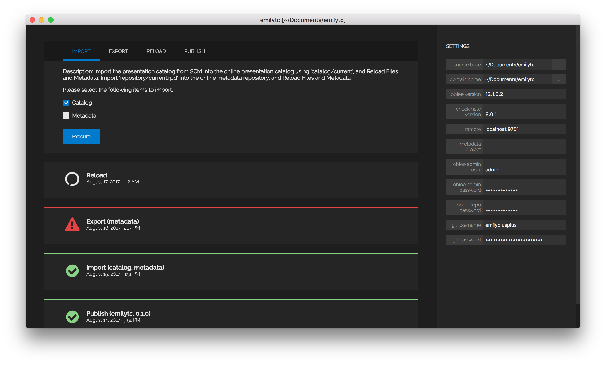

# Checkmate Examples
This repository includes examples for working with Checkmate from Red Pill Analytics. Checkmate enables Continuous Delivery for products or platforms that don't naturally support it.

### Layout
The repository is designed to have a directory for each Checkmate plugin located in the project root (called the *plugin directory*), each containing one or more example projects located in separate directories (called the *project directory*.) The project directory contains a **README.md** file that contains the Quickstart description and exercises for working with Checkmate.

Currently, we only have a single Quickstart configured: [Checkmate Build Framework for OBI using OBIEE 12.2.1.2](obi/sample-12c/README.md). This Quickstart uses content from [SampleAppLite](http://docs.oracle.com/middleware/12212/biee/BIESG/GUID-E439E473-DD4D-48FE-9BF1-7AED4ADD73B6.htm#BIESG9340) already checked-in to the Git repository. If you'd like to run this Quickstart using your own content, then simply use Checkmate Studio to commit your own content into a new project directory, and replace the project directory references (specified using `-p`) with your own, new project directory.

# Checkmate Studio

### Installation
To get started with Checkmate Studio, we simply download and install the latest version from the Red Pill Analytics [Downloads Page](http://redpillanalytics.com/checkmate-getstarted/) for our chosen operating system.

### Getting Started
After launching Checkmate Studio, we see a welcome screen where we select 'New project' to create a new Checmate for OBI project. We fill out the appropriate settings before we can begin using the application: `source base`, `domain home` or `middleware home` (depending on the version... Studio handles navigating this for you), `obiee version`, `source base type`, and `checkmate version`.

The `source base` directory is our project directory... an individual directory in our Git repository for storing our catalog and repository content, usually stored using `<root>/obi/<project directory>`. Studio will manage the filesystem underneath this project directory, regardless of the other options we choose below.

For `source base type`, we support multiple forms of storing metdata repository source: using either an MDS-XML directory (preferred), a single XML file (very specific use cases), or a binary repository (mostly for supporting MUD environments).

Checkmate Studio is powered by the same JAR library that powers the Build Framework, and there is a package manager built in for upgrading/downgrading between different versions of that JAR library.

### Executing Tasks
Checkmate Studio uses a *card* paradigm: to execute a task, we create a new *card* that represents the task we want to execute. To execute a task such as **metadata import** or **catalog export**, we simply click anywhere or click on the plus icon in the shortcut area located along the right side of the project window. Then we choose our desired task, fill in relevant data and click 'execute task'. Output will be displayed below the card. A green corner represents a success and a red corner means an error occurred.

*Note: If our task requires either Git credentials or OBIEE credentials, a small modal dialog will present itself where we can enter the appropriate credentials. If we entered the wrong credentials we can change these at anytime using the shortcut area along the right side of the project window.*

### Using Git Integration
We use the Git pane at the bottom to commit or discard code changes to the current source control branch (which can be seen in brackets in the window title).

### Further Help/Support
We can use any of the support or help links in the application to seek further assistance or help in using the Checkmate Studio application.